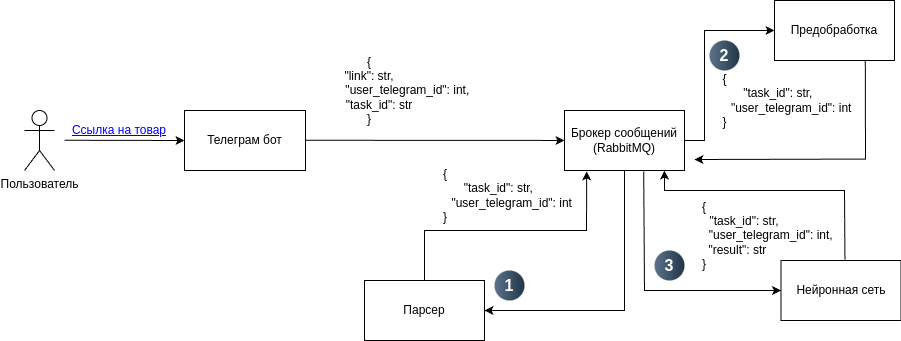

# ReviewAI — Телеграм бот,  анализирующий отзывы покупателей с Wildberries на основе искусственного интеллекта
## Описание функционала
У данного бота пока готов один функционал — определение количества накрученных отзывов. Под накрученными
подразумеваются отзывы, которые выглядят неестественно и содержат повторяющиеся  фразы.
В будущем бот будет дополнен новыми возможностями.  
На данном этапе разрабатывается функционал, который будет формировать общее впечатление о товаре на основе всех отызвов.
## Стек технологий
- python 3.10
- tensorflow
- pandas
- nltk
- selenium
- beautifulsoup
- aiogram
- rabbitmq
- sklearn
## Описание работы
Выявление накрученных отзывов происходит в несколько этапов:  
- Парсинг отзывов — На этом этапе мы собираем данные всех отзывов товара, а именно:  
  - Отзыв
  - Дата отзыва
  - Количество звезд
  - Проверка, есть ли медиа файлы (фото, видео)
- Предобработка датасета
    - Приведение всех слов к нижнему регистру
    - Токенизация
    - Удаление всех стоп слов за исключение следующих:
    ```python
    exceptions = {
        "не", "ни", "нет", "да", "или", "и", "так", "потому", "что", "когда", 
        "где", "кто", "что", "как", "зачем", "почему", "будто", "бы", "вдруг", 
        "пусть", "тоже", "все", "всё", "этот", "та", "такой", "сам", "только", 
        "другой", "ещё", "возможно", "почему", "впрочем", "хотя", "тем", "вместо", 
        "между", "также", "тогда", "вдобавок", "после", "перед", "наоборот", 
        "поэтому", "то", "тогда", "когда", "если", "даже", "включая", "совсем", 
        "именно", "через", "сейчас", "когда", "будет", "для", "от", "среди"
    }
    ```
    - Лемматизация
    - Удаление знаков препинания, кроме следующих:
    ```python
    exceptions_punctuation = {"!", "?", "-"}
    ```
- Векторизация текста. В качестве алгоритма используется **FastText**, который представляет слова в виде векторов, учитывая подсловные n-граммы.
- Предсказание нейронной сети. После того, как все данные были получены и обработаны, они подаются в нейронную сеть поочередно.

## Архитектура приложения

